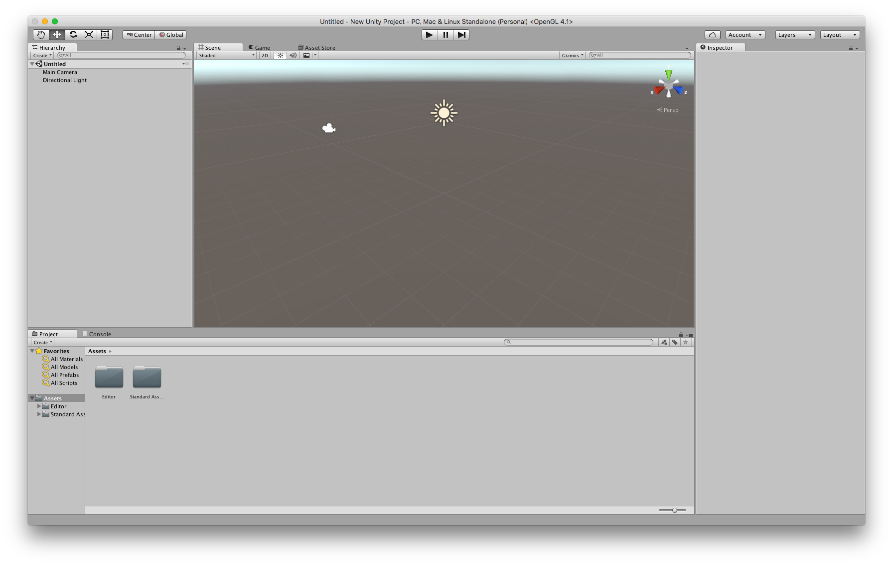
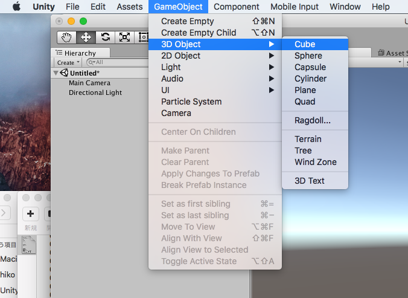
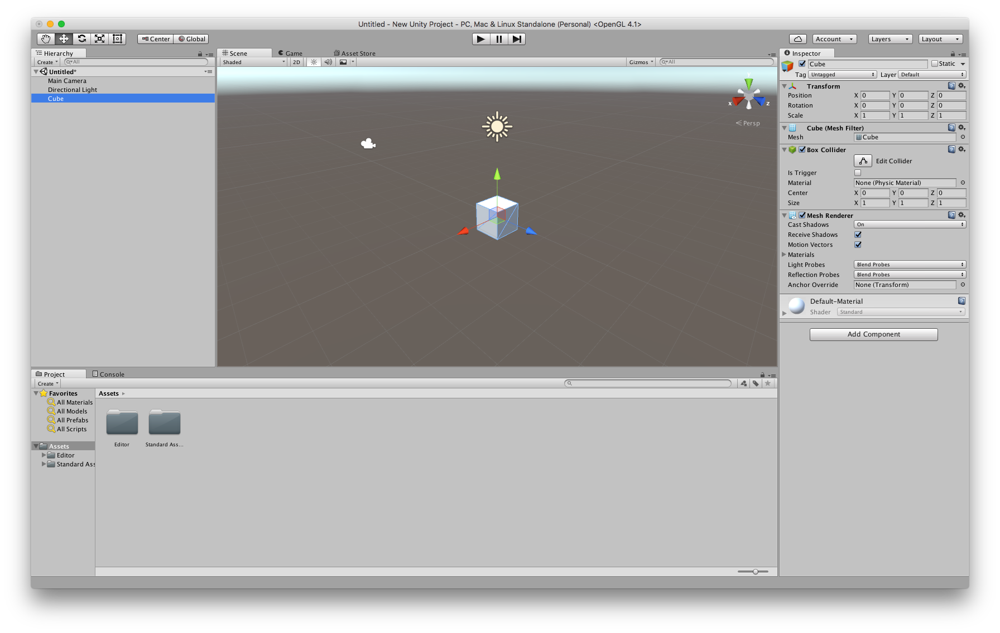

# A game-art introduction to unity
## Contents

+ [x] [Basics](#basics)
+ [x] [Physics Simulation](#physics-simulation)
+ [x] [Navigating space](#navigating-space)
+ [x] [Sound](#sound)
+ [x] [Terrain](#terrain) 
+ [ ] [Scripts](#scripts) 
+ [ ] [Basic Scripting](#basic-scripting)
+ [ ] [Interaction](#interaction)
+ [ ] [Gamepads](#gamepads)
+ [ ] [Extras](#extras)

## Basics

### Create project

+ Activate unity. Login and setting are required at first start. 
+ After that, create a new project. Specify the project name and save destination. 
+ Project has items to select 3D, 2D, but it is 3D as it is by default. Choose 3D
+ An asset is a package of unity scripts and materials gathered. From "Asset packages", add:
    + "Characters", 
    + "Environment", 
    + "Prototyping"

---
### Interface

+ **The tool bar** includes tool switching buttons for executing and stopping the game, moving and deforming elements in the scene, and the like. 
+ **Scene view** is a screen where you can actually edit within the 3D environment of the game. Main Camera and Direction Light are installed by default. 
+ **The hierarchy tab** is list of elements arranged in the game scene 
+ **The inspector tab** is for detailed setting of the element when selecting an element in the scene. 
+ **The project tab** is a window that allows you to list materials, scripts, etc. in the project.
+ **Background tabs**
    + **Console** - error and debug messaging.
    + **Game** - When you press play, this kicks into gear.
    + **Asset store** - Add resources packages and goodies.

+ **Layout** - The interface is shapable to your preference.

----

### Building scenes

+ Use **GameObjects**
    + Containers that hold different Components (3D model, textures, behaviours)
    + Every object in Scene is a GameObject (GO)
+ Use **Inspector**
    + View and edit objects and project settings
    + GOs contain Components e.g. 
        Transform,
        Camera,
        Colliders,
        Rigidbody,
        Custom Scripts.
+ Use **Scene View**
    + Free position objects, Camera, lights and interactable triggers
    + Clicking objects in the scene will highlight the GO in the Hierarchy and the Inspector will show you Components and subsequent variables.
+ **Scripting**
    + Add interaction behaviours, user input processing, where the action happens

----

### Gameobjects and Transforms - Placement, movement, rotation, deformation operation of objects

Basic primitives such as cube, sphere, capsule, cone, cylinder, board, etc. can be selected from menu. 

+ Select GameObject> 3D Object> Cube from the menu bar. 

+ A cube appears on the screen.

+ The mark on the leftmost hand of the toolbar is the movement of the viewpoint during work. Rotate the viewpoint with drag while holding down the option, drag to zoom while pressing control. 
+ With the target object selected, you can manipulate the object by pressing the Position, Rotate, and Scale buttons on the left side of the toolbar.

+ You can also select actions with shortcut keys `q, w, e, r, t` respectively. 
+ Pan around a point with `alt`
+ You can also enter numbers directly in the inspector. 
+ This is common to all objects that can be placed in the unity scene.

----

### Material settings

+ From the menu bar, select Assets> Create> Material. New material is created in the project.
+ You can set details in the inspector window with material selected.

The first **Shader** is the format of shadow processing and can get pretty freaky. Although varied depending on the application, the default is basically **Standard**, with the physically based lighting simulaiton, it versatile and, most of the time will do the job.

In **Albedo** you can set basic colour and apply overall textures to the surface. The main visual appearance is determined here. **Metallic** is the degree of metallic luster, **Smoothness** is the degree of flatness of the surface.

+ Set the colour of the material
+ Drag the material onto the cube (in screne, hierarchy or on renderer)
+ Select an albedo texture from the Standard Assets

----

### Prefabs

A **Prefab** stores object properties in a reusable way.
It is a template to make instances of in scenes.
Changes to prefabs propagate to all instances. Some exceptions to this.

+ Drag your bouncy cube into the assets folder, this creates a prefab of that type.

----

### Camera and light settings

You can also change the position and angle of lights and cameras with operations similar to other objects. 
By default, the light is linked with the background sky ( **skybox** ), and when it is tilted it will become evening or night. 
Also, the default is **Directional** , so it is like sunlight that uniformly hits the whole scene, so you can position it anywhere, but angle is important. 
Since you can arrange multiple lights , I think putting a spotlight ( **Spot** ) is necessary . 
The camera is a viewpoint when the game is actually executed, and a preview appears at the lower right while moving.
The angle of **view** of the camera can be changed along with **Field of View** on the inspector screen of the camera.

----

### Game Preview

By pressing the playback button on the toolbar, the scene view switches to game view, and you can preview the how the game will run.

----

### Save the scene

Save the edited scene. When saved, a scene file is created in the project, and scene information is saved here. It just an xml file but ignore that for now.

----

### Export and Run application

+ From the menu bar, click File> Build Settings. The application export setting screen appears. 
+ Add the current scene to the build. Do appropriate settings (windows, osx).
+ Click Build And Run, the application file itself is stored in the folder of the project or elsewhere.
+ When launching the application, various setting screens appear; 
Screen resolution, Graphics Quality, Windowed.

----

## Physics Simulation

### Set gravity and use physical calculation

Physical operation is a calculation that simulates a space with physical laws like real space. 
Inside the computer, create another world that is similar in reality and that happens in real time. 

First give gravity. Gravity acts by adding a component called rigidbody to
the primitives such as the cube created earlier . However, since there is no ground, it falls as it is.

### To make the ground

The **Prototyping** asset is a prefabricated block for verifying a rough game scene, and there are models such as walls and stairs besides the floor, which is convenient. Since assets of Prototyping added at the time of project creation are included in the project file,

+ Selected **FloorPrototype** and place it in the scene. 
+ Make the coordinates (Position) x: 0 y: 0 z: 0.

+ Select your cube game objects in the scene or hierarchy
+  Add **Rigidbody** components to each.
+ Press play. They should fall.

Also, if you change the *material* of **Box Collider** , you change how the box interacts with other surfaces. 

+ Select a cube, select the bouncy material.
+ Press play. They should bounce.

---- 

## Navigating space

### Walk around space: 1st person

Previously, we were watching the world through an inhuman fixed camera, which was placed by default, but I would like 
to arrange a character that we can freely move with.

It's hard to make from scratch, so this time I will bring it from a mature asset. 

First, uncheck the default Main Camera check box and make it inactive. 

+ Search for the prefab called **FPSController** in the
Characters Standard Assets, 
+ drag it and place it on the scene. 
+ When you play the game, you can operate with `W, A, S, D` + mouse; like a so-called FirstPersonShooter game. 

This turns control into a subjective and immersive world in which the world beyond what you are viewing through, the display (window), is navigable. 

----

### Run around space: 3rd person

**Third Person Character** is also an arranged Prefab in Characters Standard Assets. 

+ Search for the **ThirdPersonController**
+ Add to scene
+ Activate it with a checkbox of the default Main Camera. The main camera moves to the position where the placed ThirdPersonController appears. 
+ Play the game, you can move with W, A, S, D. 

However, the camera does not follow.

+ So, put the camera behind the character of 
ThirdPersonController,
+ then put the camera inside the group of ThirdPersonController, it will be the camera to follow. 

Since the moving direction of ThirdPersonController is decided on the basis of the position of the 
camera, if the Rotation: Y of the camera is slightly shifted to the left or right, the backward movement of the character does not operate properly.

----

## Sound

### Place sound in space

+ First of all, get some sound files. Go to [Freesound](http://www.freesound.org), sign up and download some sounds. 
+ Create a folder called sound and drag and drop files there. The format of the sound file that can be read is mp3, wav, aiff, ogg, etc.
+ Place the RigidBodyFPSController in the scene from the Characters assets. 
+ Also add an Audio listener component that will be your "ears" to actually pick up the sound of the space. 
+ Just like a camera, make sure that only one audio listener exists in the scene.
+ Place an object such as cube on the scene and drag and drop the sound file there. Then, the sound file is added as an **Audio Source**. 
+ Loop playback when Loop is checked. 

When Spatial Blend is set to 1, it becomes a spatial way of hearing according to the position of the sound source. For example, the overall environmental sound should be placed with Spatial Blend set to 0 and 
individual sound effects placed in Spatial Blend 1.

### Make different sonic spaces

+ Create a new empty GameObject
+ Add the Reverb Zone component, pick a preset.
+ Do a couple more and make some overlapping boudnaries and dead zones.

When you move through these zones, any sounds that occur in them are processed with the reverb creating different sensations of space.

## Terrain

### Place Terrain object

+ Place a Terrain object to make terrain. The default size of Terrain is quite large, 500 * 500. 
+ Delete or hide any Floorprototype.

### Add a texture

+ In the inspector of the Terrain object, select Paint Texture of the brush's icon . 
+ Textures> Edit Textures> Add Texture> Select texture with Albedo Smoothness. 
+ Then the whole Terrain object becomes the selected texture.
+ You can select multiple textures, you can change the texture depending on the place like drawing a picture with the Paint tool.

### Make unevenness

+ Choose the mountain icon Raise / Lower Terrain . 
+ The place you clicked gets excited and becomes a mountain. Hold down the shift key and dent with a click.

### Plant a tree

+ Select Place Tree of tree icon . Edit Trees> Add Trees> Specify prefab of trees in Tree prefab. 
+ After that, you can specify density in Mass Place Trees and place it in the whole Terrain object. 
+ As with textures and terrain, you can add trees partly as you paint with paint tools.

### Plant the grass

+ Select the clover icon Paint Details . 
+ In Edit details> Add Grass Texture, select texture for grass flowers "GrassFrond 01 Albedo Alpha" etc in Environment Asset . 
+ After adjusting by adding color and size etc., you can plant grass as you draw with paint tool like other elements.

### Become scenery

+ Adjust variously, it will be like a landscape.